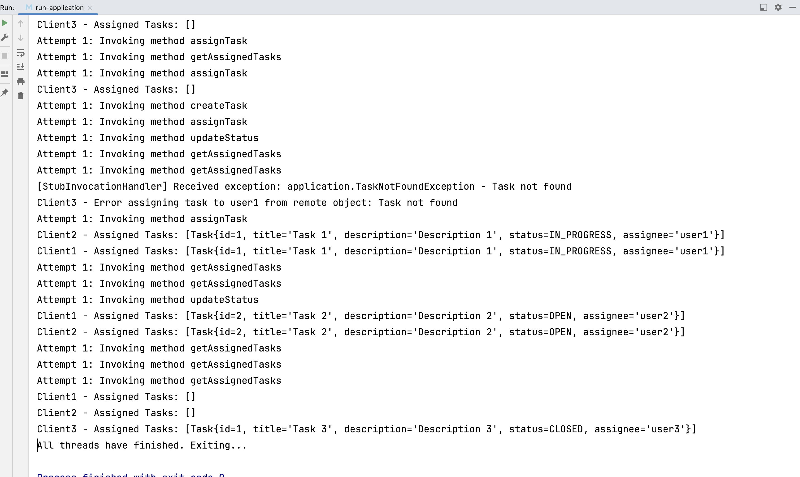
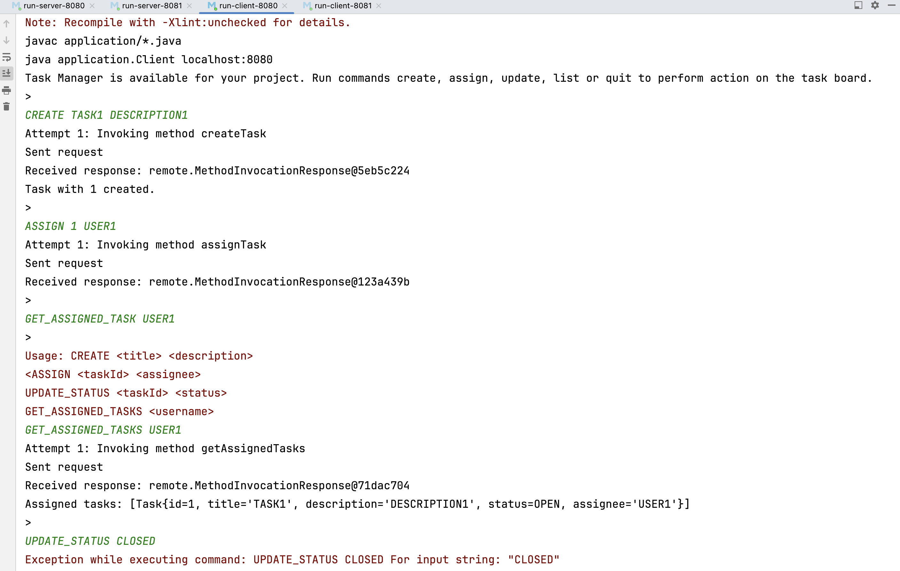
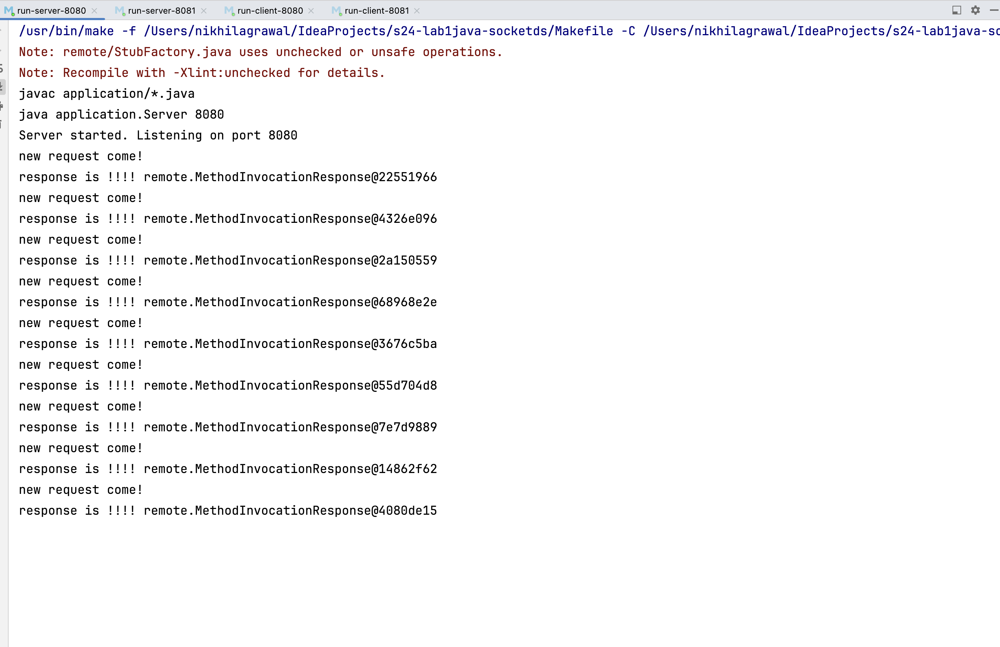

## Interaction with Remote Objects, Java Version

This file details the contents of the initial Lab 1 code repository and how to use it.


### Getting started

If you're using the same programming language for this lab as the previous one, the look and feel of this
lab should be familiar, and your environment shouldn't need any changes.  If this is your first lab using Java,
all you should need to install is a recent Java SDK and runtime.  For example, a default Ubuntu Linux installation
would only require you to do
```
sudo apt install openjdk-21-jdk openjdk-21-jre
```
to start working on the lab. Everything else is controlled by `make` using the `javac`, `java`, and `javadoc`
utilities.


### Initial repository contents

The top-level directory (called `lab1-java` here) of the initial starter-code repository includes four things:
* This `README.md` file
* The Lab 1 `Makefile`, described in detail later
* The `test` directory that contains the Lab 1 autograder, which you should not modify
* The `remote` source directory, which is where all your work will be done

Visually, this looks roughly like the following, with the `test` directory compressed for clarity:
```
\---lab1-java
        +---remote
        |   +---LeakySocket.java
        |   +---RemoteObjectException.java
        |   +---Service.java
        |   +---StubFactory.java
        |   \---package-info.java
        +---test
        |   +---remote
        |   |   +---BadInterface.java
        |   |   +---SimpleInterface.java
        |   |   +---SimpleObject.java
        |   |   +---TestCheckpoint_*.java  (2x in total)
        |   |   +---TestFinal_*.java  (7x in total)
        |   |   \---package-info.java
        |   +---util     [contains generic test suite, same as lab 0]
        |   +---Lab1CheckpointTests.java
        |   +---Lab1FinalTests.java
        |   +---Lab1Tests.java
        |   \---package-info.java
        +---Makefile
        \---README.md
```
The details of each of these will hopefully become clear after reading the rest of this file.


### Building your remote library

The `remote` package initially only includes a skeleton of the remote object library implementation for Lab 1. Your
primary task in this lab is to complete this implementation according to the specifications given in the Canvas
assignment. You are free to write all the code in the provided files or create additional files as needed. However, 
the `test` suite will instantiate various objects according to the given constructors, so you should not change those.
You are welcome (and encouraged) to read the `test` code to see how the tests work and what they are testing.


### Testing the remote library

Once you're at the point where you want to run any of the provided tests, you can use the provided `make` rules. To run
the set of Checkpoint tests, execute `make checkpoint` from the main working directory of the lab. Similarly, to run the 
Final tests, execute `make final`. If you want to run all of the tests (checkpoint and final), you can execute `make all`.
You can also run subsets of tests by commenting out test Classes in the Lab 1 test files.

Because our expected outcome in this lab is a library, it's a little more tricky to test than our game server was in Lab 0.
However, since we're again using sockets for interaction between components, you are free to use similar approaches and test
tools that you used previously (e.g., `nc`). Printing/logging status and error messages can be very helpful, but make sure to
remove any such functionality from your code before making your final submission (unless you can't pass all the tests and want
to include it in support of partial credit).

You are welcome to create additional `make` rules in the Makefile, but we ask that you keep the existing `final` and `checkpoint`
rules, as we will use them for lab grading.


### Example application

In the later part of the lab, once your `remote` package is complete, you'll build your own custom application that imports
the external library.  Your application should be created in a new folder within the `src` directory (at the same level as 
the `remote` directory), and it should include at least two separate classes (since they would really be executed on different
machines over a network) for the client and server application code, each with its own `main` function that can be executed 
from the command line after compiling.  You are welcome to add new rules to the `Makefile` for launching these different 
application components, but this is not necessary as long as the commands to run them are clearly documented in your submission.
However, good documentation is expected for the application.  In addition to standard documentation, you will need to write a 
small usage guide for how the application works.


### Generating documentation

As done previously, you can use the Javadocs utility to create browseable documentation for the `remote` and `test` packages
using the `docs` and `docs-test` Makefile rules, and your final submission should include the `doc` folder created by `make docs`.


### Example Application Description
I developed a Tasks management system where users can efficiently manage tasks using various capabilities :
* creating tasks, assigning them to specific users, updating task statuses, and retrieving task lists
* The application uses a stateful architecture
* Task information is persistently stored on the server
* Users can retrieve updated task details in subsequent queries
* Design : Remote Interface ``TaskManager`` and remote implementation ``TaskManagerExecutor``. Remote state maintained
  is a list of ``Task`` objects. interface and implementation support all the features mentioned above.
* I have created a simple ``ExampleSimulator.java`` to demonstrate the usage of all the above features using remote library.
* There are 2 server threads(8080 and 8888 ports) and 3 Client threads.
* Client1 and Client2 connecting to 8080, Client3 connecting to 8888.
* Client1 and Client2 will have shared tasks and Client3 will have a different tasks state.
* Client1 and Client2 are able to retrieve, create and updates Task1 and Task2.
* Client3 is not having access to Task1 and Task2. It can only retrieve, create and updates Task3.
* I also have a ``Server.java`` and ``Client.java`` to provide interactive command line interface to use the Task management system.
##### Note: Refer to the java-docs for more details.
#### Commands to run the application
* To build ``application`` package:```make build-application```
* To run ``ExampleSimulator.java``:```make run-application```
  
  
  
### Failure Scenarios
* The remote library is not handling a case where a complex user defined object is not implementing the Serializable interface.
* The remote library temporarily does not incorporate explicit security protocols, including authentication, authorization, or encrypted communication.
* The library lacks mechanisms for dynamic load balancing. Given that service locations may shift dynamically in actual distributed systems,
  the capability for clients to detect services and allocate loads according to service availability is essential but hasn't been included in our current implementation.

